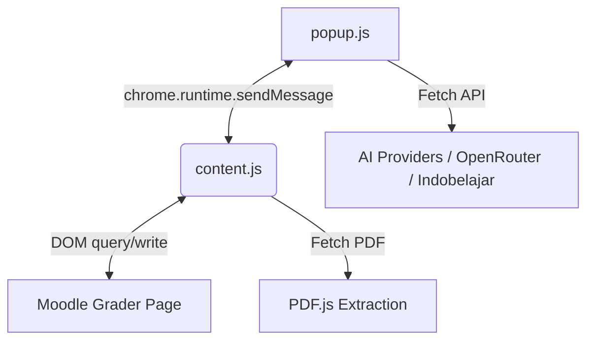

# Software Design Document (SDD)
## Project: UT E-Learning Text Grabber & AI Assistant
**Version:** 1.8.0-dev  
**Date:** May 29, 2026  

---

## 1. System Architecture
The Chrome Extension operates under the standard Chrome Manifest V3 standard:
- **`popup.html` / `popup.js`**: UI Panel that runs in the extension context. Handles layout styling, state representation, model selection, API key authorization, and user inputs.
- **`content.js`**: Executed in the active tab context of `elearning.ut.ac.id`. Scrapes DOM nodes, manipulates input fields, and interacts with the page's TinyMCE feedback iframes.
- **`background.js`**: Background service worker handling extension lifecycle and routing.



---

## 2. Key Components & DOM Target Identifiers

### Grader DOM Selectors
- **Grade Input**: `input#id_grade`
- **Feedback Comments Textarea**: `textarea#id_assignfeedbackcomments_editor`
- **Feedback Comments TinyMCE Iframe**: `iframe#id_assignfeedbackcomments_editor_ifr`
- **Student Profile Link**: `a[href*="/user/view.php"][href*="course="]`
- **Title Block**: `document.title`

### TinyMCE Bidirectional Communication
Because Moodle encapsulates its WYSIWYG feedback editor within a same-origin iframe, we execute updates as follows:
```javascript
const iframe = document.getElementById('id_assignfeedbackcomments_editor_ifr');
const iframeDoc = iframe.contentDocument || iframe.contentWindow.document;
const body = iframeDoc.getElementById('tinymce');
body.innerHTML = `<p>${feedbackText}</p>`;
```

---

## 3. Style Tokens (Bio-Digital Minimalism 2026)
- **Primary Surface**: `hsl(152, 45%, 15%)` - Calming forest green temperature to minimize screen stress.
- **Glass Panel Accent**: `hsla(0, 0%, 100%, 0.1)` with `backdrop-filter: blur(12px)`.
- **Text Hierarchy**: `Inter` or standard Segoe UI, scaling seamlessly via proportional sizing.
