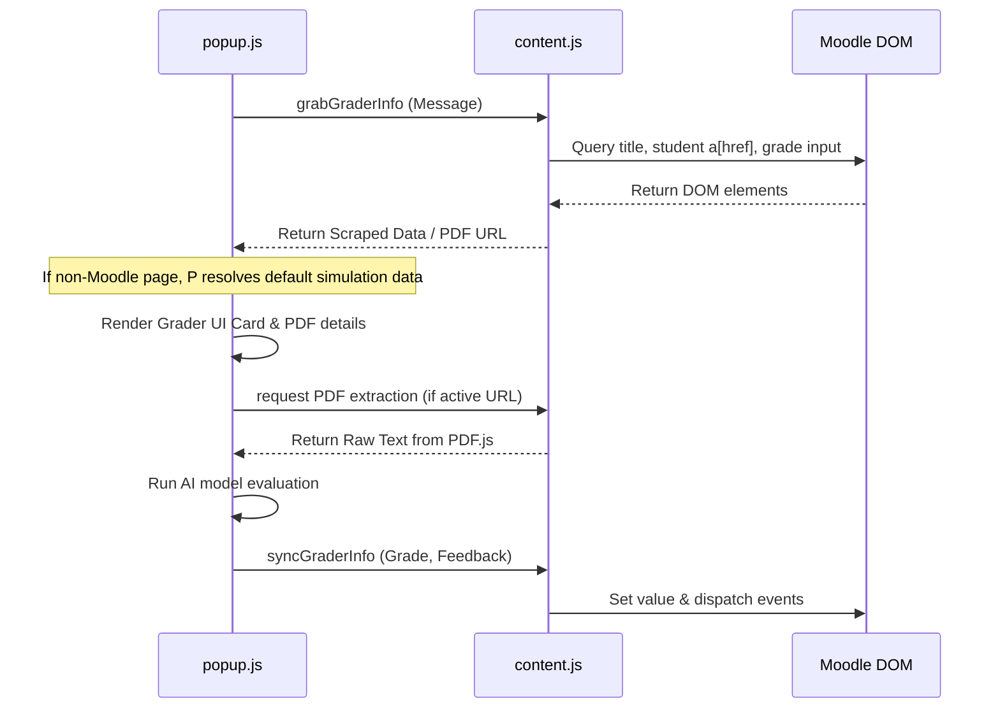

# Software Requirements and Design (SRD)
## Project: UT E-Learning Text Grabber & AI Assistant

---

## 1. Requirement-to-Design Traceability Matrix

| Requirement ID | Description | Design Component | File/Module |
|----------------|-------------|------------------|-------------|
| **REQ-01** | Extract Student Identity (Name, NIM, Email, Due Date) | Grader DOM parser using childNodes text separation and query selectors | `content.js` -> `grabGraderInfo()` |
| **REQ-02** | Fetch and parse Student assignment PDFs on Grader page | Embedded PDF.js arrayBuffer extraction and string map parsing | `popup.js` & `content.js` -> `extractTextFromPDF()` |
| **REQ-03** | AI Feedback Generation based on PDF + RAT syllabus | Gemini, OpenAI, Claude, and OpenRouter direct payload builder | `popup.js` -> `callAIAPI()` |
| **REQ-04** | Direct synchronization of Grade and Feedback comments | DOM value replacement with synthetic dispatch events (`input`, `change`) to bypass Moodle form validation triggers | `content.js` -> `syncGraderInfo()` |
| **REQ-05** | Demonstration Sandbox / Simulation state | Elegant glassmorphism UI container presenting robust mock values | `popup.html` / `popup.js` -> `loadGraderData()` |

---

## 2. Dynamic Workflows

